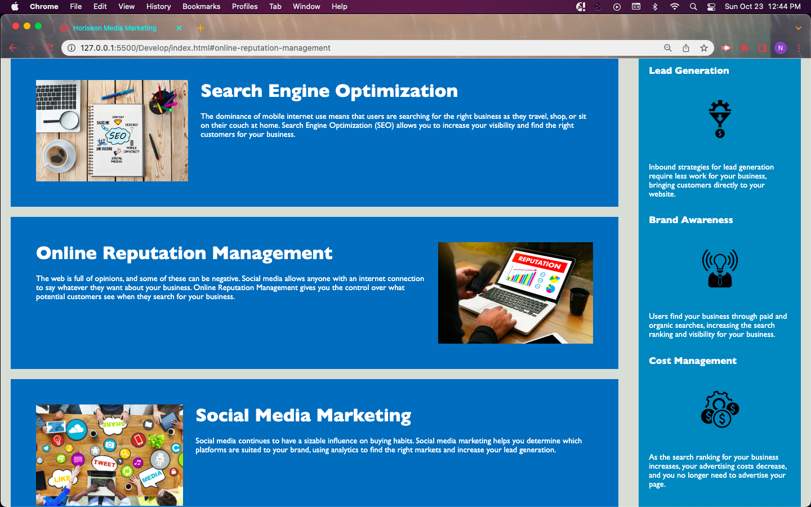

# HTML and Css Challenge

## Description

This project is designed to understand the fundamentals of HTML, CSS, Git, and apply key concepts learned the past week to restructure and optimize an existing webpage. 

The soul reason for this page is to get more of a hands on approach to a problem developers do everyday. 

## Insallation

N/A

## Usage

This page will serve as an introduction to a real website with real applications to it with great information about a product, image inclusion, and basic wepage navigation functions.

Below you will find a screenshot to my updated website.

[Next will be the link you can reach the webpage at!](https://volexity21.github.io/html_css_challenge/#social-media-marketing)

## Credits

I used Xandromus's starter code for this project which had the wepage already built but needed some final tweaks to organize.

